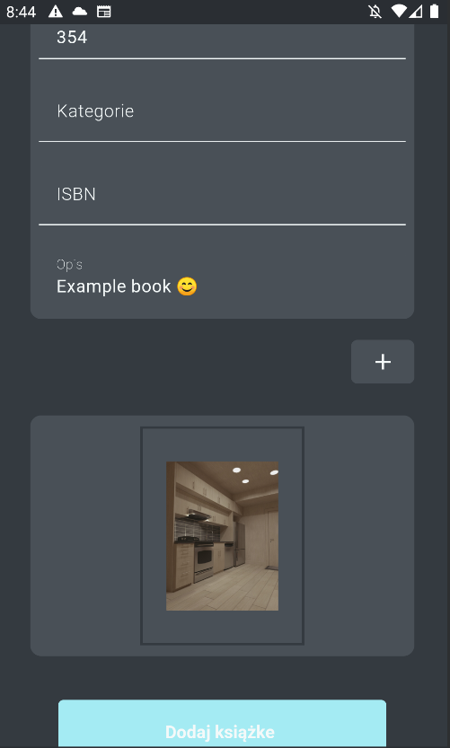
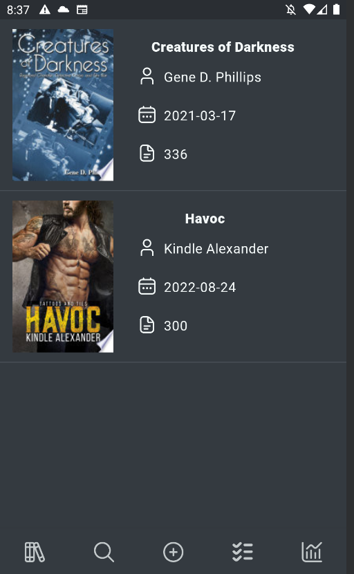
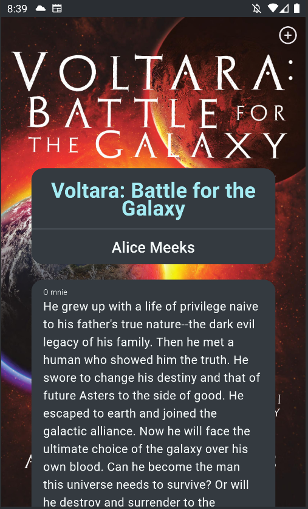
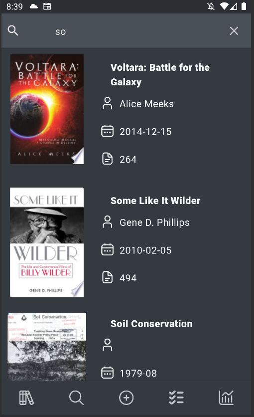

# :books: Hello Books 

### Useful app to manage your books collection 
 
##  :bulb: Features
• You can add all books from your collections and manage them  
• Use search engine to find specific book and upload on your bookshelf  

 

## :wrench: Technologies
 • Room  
 • Hilt  
 • Jetpack Compose  
 • Ktor  
 • Flow  
 • Navigation  

 

## :dart: Project goals
• Book wish list  
• Basic statistics (e.g. How many pages I read, How many books I have on bookcase)  
• Add tools to manage our progress  
• Filters and more options for search engine  
• Images,animations and app icon  

 

## :wave: Author 
Daniel Dąbrowski
